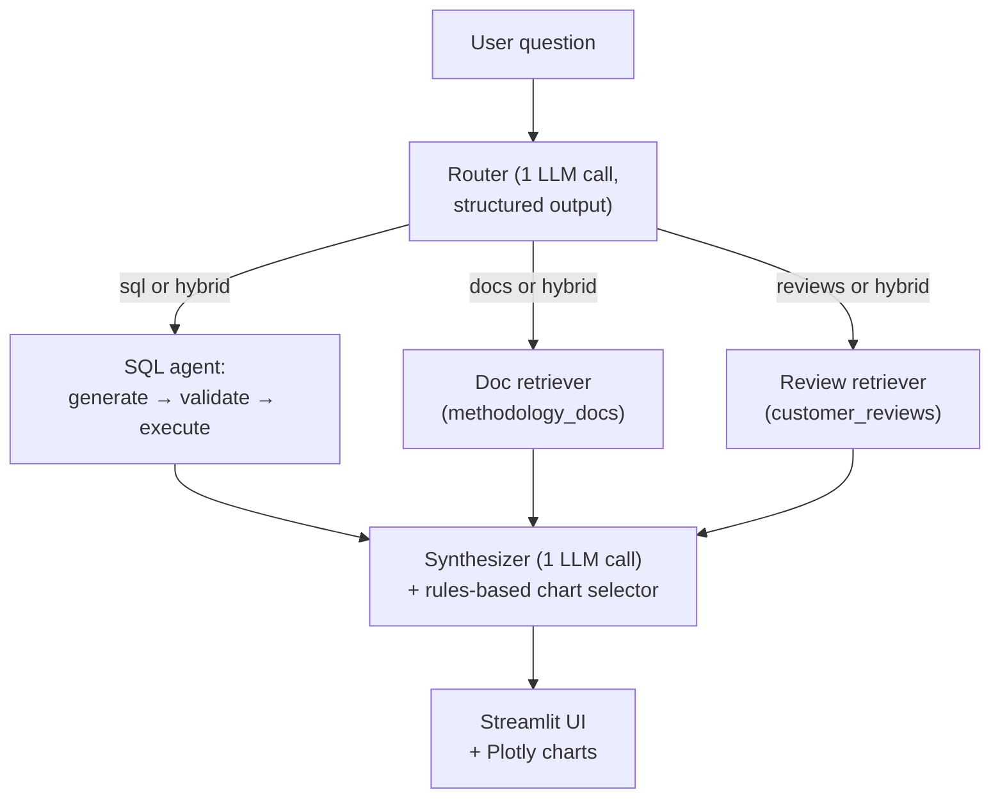

# Hybrid Analytics Agent

An AI agent that answers business questions about the [Olist Brazilian
e-commerce dataset](https://www.kaggle.com/datasets/olistbr/brazilian-ecommerce)
by routing between three sources -- a SQL database, methodology playbooks,
and 41K customer reviews -- and synthesizing one answer with cited sources
and a transparent reasoning chain.


<!-- replace docs/screenshot.png with a captured screenshot of the running app -->

## Why this project

Most "analytics co-pilot" demos are either NL-to-SQL wrappers that cannot
handle "why" questions, or RAG chatbots that cannot touch real data. This
project combines both: a routing layer classifies each question into
`sql`, `docs`, `reviews`, or `hybrid`, runs the relevant tools in
parallel, and stitches the result into a single answer with inline
citations. The non-trivial parts -- the router's prompt, the SQL
validator's three-layer safety model, the synthesizer's source-stitching
logic, and the eval harness's per-stage failure attribution -- are all
written by hand against the raw OpenAI and ChromaDB SDKs, no LangChain.

## Architecture



The router emits a structured decision (route, reasoning, suggested SQL
tables, doc query, review query). The downstream stages run independently;
only the synthesizer ever sees their combined output. Per-stage latency
and tokens are recorded on every call for the reasoning chain and the
eval report.

For deeper module-by-module rationale see [`architecture.md`](architecture.md).

## Tech decisions

| Component | Choice | Why not the alternative |
|---|---|---|
| LLM | `gpt-4o-mini` | gpt-4o full is overkill at this size; gpt-3.5 is too weak on hybrid synthesis. Cost: ~$0.0008/question on the eval. |
| Embeddings | `text-embedding-3-small` | 5x cheaper than -large with negligible quality loss at this volume; works across English queries and Portuguese review text. |
| Vector store | ChromaDB persistent local | Single directory, no server. pgvector requires Postgres; FAISS lacks the metadata filters used by the review retriever. |
| Database | SQLite | One file, read-only mode for safety. DuckDB is faster on aggregates but adds a dependency with no observable benefit at 1.5M rows. |
| LLM framework | None (raw `openai` + `chromadb`) | LangChain / LlamaIndex abstract away the routing classifier and prompt assembly, which are the parts of this project worth showing. |
| Charts | Plotly | Native interactive rendering in Streamlit. Matplotlib needs `st.pyplot` and has no hover. |
| UI | Streamlit | Single-file analytics UI. Gradio is similar; a React app is wrong scope. |
| SQL safety | Static checks + `EXPLAIN` + `mode=ro&immutable=1` | Defense-in-depth. Each layer alone is bypassable; together they make a non-`SELECT` query reach the DB only by an explicit code path that does not exist. |

## Quickstart

```powershell
# Windows / PowerShell
python -m venv .venv
.venv\Scripts\Activate.ps1
pip install -r requirements.txt

Copy-Item .env.example .env
# Edit .env to set OPENAI_API_KEY

# Build the SQLite DB from the 9 Olist CSVs in dataset/
python scripts/1_load_data.py

# Embed methodology docs and ~41K customer reviews into ChromaDB
python scripts/3_embed.py

# Launch the UI on http://localhost:8501
python scripts/4_run_app.py
```

### Download the dataset

The 9 Olist CSVs (~121 MB) are **not** committed to this repo. Download
the [Brazilian E-Commerce Public Dataset by Olist](https://www.kaggle.com/datasets/olistbr/brazilian-ecommerce)
from Kaggle and unzip into `./dataset/` so the directory contains:

```
dataset/
├── olist_customers_dataset.csv
├── olist_geolocation_dataset.csv
├── olist_order_items_dataset.csv
├── olist_order_payments_dataset.csv
├── olist_order_reviews_dataset.csv
├── olist_orders_dataset.csv
├── olist_products_dataset.csv
├── olist_sellers_dataset.csv
└── product_category_name_translation.csv
```

To put the CSVs elsewhere, set `OLIST_CSV_DIR` in `.env`.

The SQLite build takes ~8 seconds. The embedding build is the long pole
(~12 minutes for the reviews collection), but it runs once: ~818K input
tokens at $0.02/M, total ~$0.016.

## Example queries

### `sql`: *"What was the total revenue across all orders placed in 2017?"*

> The total revenue across all orders placed in 2017 was **$7,142,672.43**, calculated by summing the price and freight value of order items for that year.[sql]

Generated SQL (executed in 391 ms, returns one row):
```sql
SELECT SUM(oi.price + oi.freight_value) AS total_revenue
FROM orders AS o
JOIN order_items AS oi ON oi.order_id = o.order_id
WHERE o.order_purchase_timestamp >= '2017-01-01'
  AND o.order_purchase_timestamp <  '2018-01-01'
LIMIT 1;
```

### `docs`: *"How is the seller performance score calculated?"*

> The seller performance score is a composite metric used for seller leaderboards, calculated using three equally weighted components, each rescaled to a 0-1 scale: (1) the average review score on items sold by the seller, normalized using the formula `(score - 1) / 4`; (2) the on-time delivery rate, which measures the proportion of items delivered on or before the estimated delivery date; and (3) the order completion rate, defined as `1 - cancellation rate`.[doc:kpi_definitions.md] The final score is the average of these components, with a minimum threshold of 10 orders for the score to be considered meaningful.[doc:kpi_definitions.md]

Top doc hits: `kpi_definitions.md` chunks 6, 7, 8 (distance 0.99-1.00).

### `hybrid`: *"Why are northern Brazilian states slower to receive orders?"*

> Northern Brazilian states exhibit slower delivery times compared to other regions. For instance, the state of Roraima (RR) has the longest average delivery time at approximately 29.39 days, while Amapá (AP) and Amazonas (AM) also show extended times of 27.19 and 26.43 days, respectively.[sql] This is attributed to geographic factors: sellers are predominantly located in the Southeast (e.g., SP, RJ, MG), making distance a strong predictor of delivery speed. Northern states often experience delays 2-3x longer than the Southeast.[doc:delivery_performance.md] Customer reviews further reflect this -- multiple complaints highlight delivery delays.[review:563374a9][review:5510c1ad]

Pipeline fired all three downstream tools: SQL (27 rows of avg-days-by-state), 5 doc chunks across `delivery_performance.md` / `kpi_definitions.md`, 5 review excerpts. End-to-end 14.2s.

## Evaluation results

Numbers below are from a single run on 2026-05-09. Full report:
[`eval/results/report.md`](eval/results/report.md). Per-question raw
scores: [`eval/results/raw.json`](eval/results/raw.json). Re-run with
`python eval/run_eval.py`.

### Headline metrics (n=30)

| Metric | Value |
|---|---|
| Routing accuracy | **28 / 30 (93%)** |
| SQL execution rate | **20 / 20 (100%)** |
| SQL returned ≥1 row | **20 / 20 (100%)** |
| Doc retrieval hit rate (top-5) | **19 / 20 (95%)** |
| Chart appropriateness | **24 / 26 (92%)** |
| Average keyword coverage | **0.72** |
| Total tokens | 187,632 (122,368 cached, ~65% prompt cache hit) |
| Estimated chat-completion cost | **$0.0232** for 30 questions (~$0.0008 each) |
| Total wall time | 279 s |

### Routing confusion matrix

(Rows = expected, columns = predicted.)

| expected \ predicted | sql | docs | reviews | hybrid |
|---|---|---|---|---|
| **sql** | **10** | 0 | 0 | 0 |
| **docs** | 0 | **9** | 0 | 1 |
| **reviews** | 0 | 0 | -- | 0 |
| **hybrid** | 0 | 1 | 0 | **9** |

`sql` perfect; one `docs → hybrid` (defensible) and one `hybrid → docs`
(real bug). The eval test set has no `reviews`-only questions; the
pipeline smoke test covers that route separately.

### Latency per stage (ms; over the eval run)

| Stage | n | p50 | p95 | max |
|---|---|---|---|---|
| router | 30 | 1101 | 1463 | 1652 |
| sql | 20 | 5672 | 10361 | 13083 |
| docs | 19 | 431 | 670 | 1259 |
| reviews | 5 | 623 | 1592 | 1592 |
| synthesis | 30 | 3999 | 6212 | 6447 |
| **TOTAL** | 30 | **7443** | **17811** | 21439 |

Vector retrieval is fast and stable. SQL generation dominates `sql` /
`hybrid` latency; synthesis dominates `docs` latency. The router itself
costs ~1s after warm cache.

## Failure analysis

The eval surfaced seven questions with at least one failed check, but
they fall into three buckets and only two are real bugs.

### Real failure 1 -- SQL generator: inconsistent NULL filter

**`sql-05`**: *"What share of delivered orders arrive on or before the
estimated delivery date?"* The agent generated:

```sql
SELECT COUNT(*) * 1.0 / (SELECT COUNT(*) FROM orders AS o
                         WHERE o.order_status = 'delivered') AS share_on_time
FROM orders AS o
WHERE o.order_status = 'delivered'
  AND o.order_delivered_customer_date <= o.order_estimated_delivery_date
  AND o.order_delivered_customer_date IS NOT NULL
LIMIT 1;
```

The numerator excludes rows with `order_delivered_customer_date IS NULL`;
the denominator does not. Result: **91.88%** vs the methodology doc's
**93.2%**. About 1.4% of delivered orders have NULL delivery dates and
are penalized as "not on time" by this query. This is a class of bug
that a static SQL linter could catch (require consistent filters across
numerator and denominator of a ratio); see "What I'd change" below.

### Real failure 2 -- Router: missed action verb in `hybrid-04`

**`hybrid-04`**: *"Compute the repeat purchase rate. Reference our defined
formula in the answer."* Routed to `docs`, not `hybrid`. The agent
quoted the formula correctly but never executed any SQL, so the user
got the methodology with no number. The router weighted "reference our
defined formula" (docs cue) over "Compute" (sql cue). A short list of
imperative verbs (`compute`, `calculate`, `show me`, `compare`) biased
toward sql/hybrid would catch this without a model swap.

### Defensible / borderline

**`docs-07`** (*"What does it mean if a category has avg review below
4.0?"*) routed to `hybrid` instead of `docs`. The agent enriched the
methodology answer with two real low-scoring categories from the data.
Strictly off-spec, substantively better.

**`hybrid-03`** (*"Are electronics reviews lower than the global average
and if so, why?"*) had `confidence=0.50` (the lowest in the run) -- the
agent honestly flagged that the available data and reviews were not
enough to confirm a clean causal story. Self-reported confidence working
as intended.

### Measurement artifacts (not real bugs)

Four other low keyword-coverage scores trace to the substring-matching
metric being too strict, not to the agent being wrong:

- `sql-01` / `sql-08`: keyword list had `"99,441"` and `"99441"` as
  alternates; model returned `"99,441"`, missing the no-comma form.
  Coverage 0.50 instead of 1.00.
- `sql-04`: model returned `"approximately 4.09"`; keyword list had
  `"4.0"` and `"4.1"`. The 4.0 substring of 4.09 matched; 4.1 did not.
  Both mean the same thing.
- `sql-06`: model returned categories as `"Health & Beauty"` (display
  form) instead of `health_beauty` (DB form). Coverage 0.00, semantically
  perfect.
- `docs-08`: model said *"proportion of unique customers"*; keyword list
  expected `"share"` and `"customer_unique_id"`. Paraphrase, technically
  correct.

These five questions drag the average keyword coverage from ~0.86 to
0.72. The honest agent quality is closer to the 0.86 number; an
LLM-as-judge metric would show that.

## What I'd change with more time

1. **Hybrid-bias the router on action verbs.** Add a short verbs list
   (`compute`, `calculate`, `show`, `compare`, `rank`) to the router's
   system prompt with a rule that an action verb shifts the prior toward
   `sql` or `hybrid`. Likely catches `hybrid-04` without retraining.
2. **Static SQL linter for ratio consistency.** Pass that detects
   numerator / denominator queries with mismatched `WHERE` filters or
   mismatched `IS NULL` exclusions. Flags `sql-05`-class bugs cheaply.
3. **LLM-as-judge for keyword coverage.** Substring matching penalises
   paraphrase and presentation transformations. A second-pass judge
   call per (question, expected, answer) tuple would untangle real misses
   from cosmetic ones. Cost: ~30 extra completions, ~$0.005 per eval.
4. **A `reviews`-route eval set.** The pipeline supports `reviews` and
   the smoke test covers it, but no scored examples exist. 8-10
   questions with `score≤2` filters and category filters would close the
   loop.
5. **Auto-route well-known formulas to `hybrid`.** Repeat purchase rate,
   CLV, RFM, seller score all have CTE patterns the SQL generator
   cannot reliably write cold. If the question matches a known KPI name,
   force `hybrid` so the synthesizer has the formula doc and the SQL
   generator only needs to translate it. Cleanly fixes `hybrid-04`.

## Project structure

```
hybrid-analytics-agent/
├── CLAUDE.md                       # session instructions for the agent that built this
├── README.md
├── architecture.md
├── requirements.txt
├── .env.example
├── .gitignore
├── data/
│   ├── docs/                       # 6 methodology playbooks (RAG corpus)
│   ├── olist.db                    # generated by scripts/1_load_data.py
│   └── chroma/                     # generated by scripts/3_embed.py
├── dataset/                        # the 9 Olist CSVs (gitignored; download from Kaggle)
├── src/
│   ├── config.py
│   ├── db/                         # CSV -> SQLite loader + schema introspection
│   ├── router/                     # routing classifier
│   ├── sql_agent/                  # generator + validator + executor
│   ├── retriever/                  # embedder + 2 retrievers + ingestion
│   ├── synthesizer/                # answer generator + chart selector + sources
│   ├── charts/                     # Plotly figure factory
│   └── pipeline.py                 # orchestrator
├── app/
│   └── streamlit_app.py
├── eval/
│   ├── test_questions.json         # 30 scored questions
│   ├── run_eval.py
│   └── results/
│       ├── raw.json                # per-question scores
│       └── report.md               # generated report
└── scripts/
    ├── 1_load_data.py
    ├── 3_embed.py
    ├── 4_run_app.py
    ├── test_router.py
    ├── test_sql_agent.py
    ├── test_retriever.py
    ├── test_synthesizer.py
    └── test_pipeline.py
```

## License

[MIT](LICENSE).

## Author

Shivaang Dayavarshetty -- [github.com/ShivangD1508](https://github.com/ShivangD1508)
-- shivaang.dayavarshetty@gmail.com
